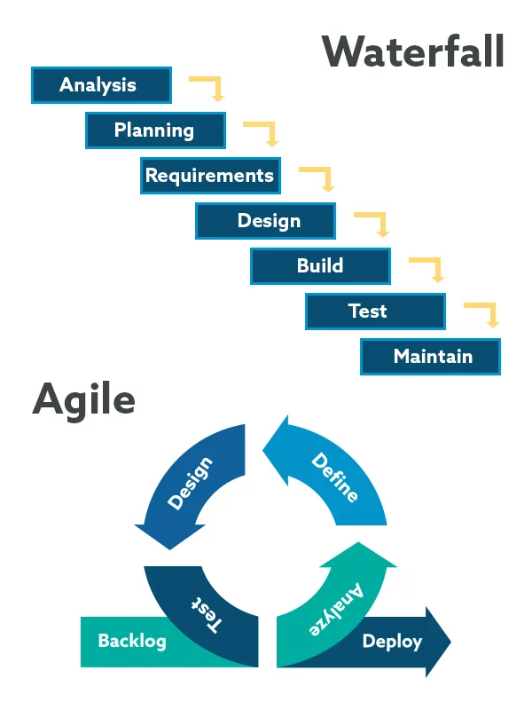
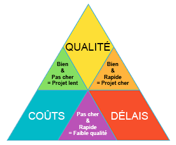

# J01 - Gestion de projet & Architecture

## Menu du jour

```
- Analyse d'une demande client
  - Gestion projet
    - Analyse des besoins client
    - **User stories**
    - Plannification / Budgetisation
    - **Maquettage**
      - Zoning / Wireframe / Mockup
    - Analyse outillage (Express / Postgres / Sequelize)
  - Modélisation
    - MCD
    - MLD
  - Méthodes agiles
    - SCRUM
    - Kanban


- Architecture Express
  - Révisions
  - Intégration
```


## Agile ? SCRUM ? 


Deux méthodologies principales : 
- **waterfall** ==> on planifie -> on livre
- **agile** ==> on planifie -> on livre -> on prend les feedbacks -> on **réitère** -> on livre -> on prend les feedbacks




Exemples de méthodologies **Agile** : 
- SCRUM (la plus populaire) et ses adaptions
- RAD
- eXtreme Programming
- Behavior Driven development
- [La rache](https://www.la-rache.com/)

Chaque méthodologie propose sont propre vocabulaire et ses propres outils : 
- user stories
- wireframes
- kanban
- product owner
- backlogs
- poker planning
- ...

Aujourd'hui, on a vu quelques outils : 
- **wireframes**
- **user stories**
- kanban
- **MCD**


SCRUM = **un ensemble d'outils, de méthodologies, de lexique**... généralement pour le développement logiciel.

C'est une **méthode Agile** :
- ==> `itération du logiciel` (V1 --> V2 ---> V3 --> V4)
- récupérer les feedbacks des clients

Différence avec les projets avec une gestion de projet type "**Waterfall**" :
Quand on construit un pont, on utilise généralement pas de méthode agile ==> grande phase de conception

[Lien d'un manifeste Scrum (FR)](https://scrumguides.org/docs/scrumguide/v1/Scrum-Guide-FR.pdf)

Dans le glossaire SCRUM (entr eautre) :
- **product owner** : la personne qui s'occupe de définir le produit
- **backlog** : liste des fonctionnalités à implémenter dans le futur
- **sprint** : une étape du logiciel, se termine généralement par une nouvelle livraison du logiciel (déploiement de la nouvelle version en fin de sprint)
- **daily** : réunion matinale pour faire un point de l'avancement de chacun.

## Une nouvelle fonctionnalité dans mon projet ?

J'y réfléchi à deux fois : 



## User stories

[User stories](../project-analysis/user-stories.md)

## Maquettage

[Maquettage](../project-analysis/maquettage/)

## MCD

[MCD](../project-analysis/mcd/)

## MLD

[MLD](../project-analysis/mld/)

## Kanban

Un kanban est un **outil** de gestion de projet : un **board** de gestion de projet avec des **COLONNES** et des **TACHES** à l'intérieur.

Outils
- Trello
- Jira
- Github Project
- Notion

Exemple : [Kanban de Oquiz](https://github.com/O-clock-Pavlova/S10-S11-oquiz-enzoclock)


## Recap' gestion de projet 

==> On ne fonce pas la tête baissé dans le code. Généralement, on risque d'implémenter des fonctionnalités pas demandé par le client et en oublier.

Outils de clarifications :
- **user stories**
- zoning > **wireframes** > mockups
- questions / réponses
- modélisation **MCD**

Outils de planning et réalisation :
- kanban (planning et organ)
- issues github

