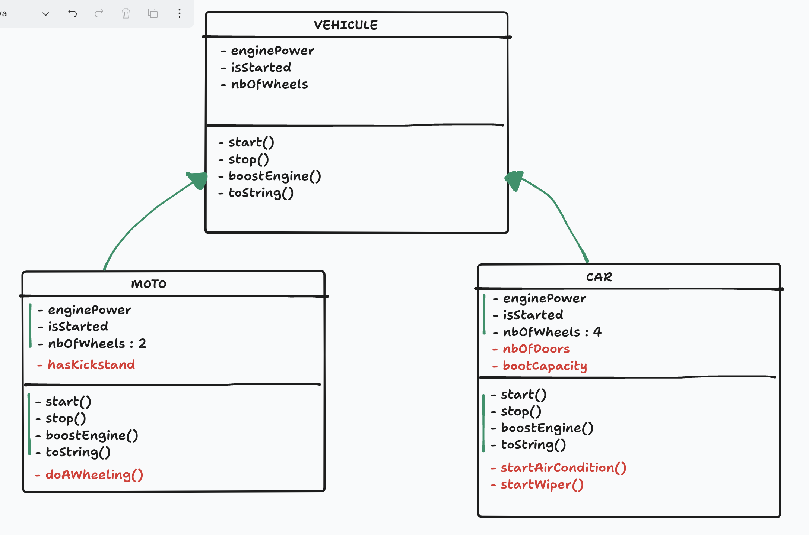

# J02 - MLD, MPD, OOP

## Menu du jour

```
- Correction Challenge
  - MLD
  - MPD
  - Scripts NPM

- POO | Programmation Orienté Objet
  - (Factory Design Pattern)
  - Classes / Instances
    - Attributs publiques/privés avec setter/getter 
    - Méthodes d'instance
    - (bonus) Méthodes de classe
    - Héritage
```

## Créer l'utilisateur et la BDD

- Se connecter à son serveur SGBD Postgres via le client CLI psql : 
  - `sudo -i -u postgres psql`

- Créer un utilisateur de BDD (admin pour notre future BDD) : 
  - `CREATE ROLE oquiz WITH LOGIN PASSWORD 'oquiz';`

- Créer une BDD :
  - `CREATE DATABASE oquiz WITH OWNER oquiz;`

- Se placer sur la BDD oquiz avec mon utilisateur oquiz
  - `\c oquiz oquiz`

- Exécuter un fichier 
  - `\i <chemin_du_fichier>`

- Vérifier la présence des tables
  - `\d`

- Vérifier une table
  - `\d nom_table`

- Si problème avec MON script, pensez à supprimer et recréer votre BDD
  - `DROP DATABASE oquiz;`
  - `CREATE DATABASE oquiz WITH OWNER oquiz;`


- Note : on peut aussi exécuter le script en DEHORS de psql 
  - `exit` (pour sortir de PSQL)
  - `psql -U oquiz -d oquiz -f chemin_vers_le_fichier`


## POO - Programmation Orientée Objet

(en 🇺🇸 OOP, Object-Oriented Programming)

### Disclamer

En JavaScript, on a déjà des objets `{}`. 

Mais certains languages n'en présentent pas par défaut (ex : `C++`, `Java`, ...) et utilise une autre syntaxe pour créer des objets.

En JS, faire de la POO, c'est un peu du "**sucre syntaxique**" => on pourrait tout faire sans POO. 

### Pourquoi apprendre la POO ?

- Omniprésent dans d'autres languages, et la syntaxe est généralement très similaire voire identique.
- Parfois présent en JS (`new Date()`, `new Error()`, `new Client()`, dans des librairies comme `Sequelize`, etc...)
- Une façon de codé très classique => un **Design Pattern**. Par exemple, beaucoup de POO dans le developpement de jeux vidéos.
- Pourquoi maintenant ? Parce que l'objectif de cette saison est d'introduire `Sequelize` (ORM) qui utilise la POO sous le capot ! 

### Kesako ?

Objet = représenter "quelque chose" avec des propriétés. Souvent avec des éléments communs.

Derrière la POO, on trouve une notion de **Factory** = une fabrique à objet, un sorte de "moule" pour générer des objets au même format.

- `20min` : voyons ensemble se design pattern factory SANS POO (en JS pure) pour comprendre le principe
- `40min` : on ajoute le sucre syntaxique de la POO (`class`, `new`) pour apprendre la POO !


### Factory

Une fonction factory est une fonction qui permet de fabriquer des objets avec toujours le même format. 


### Propriété publique et privée

```js
class Cat {
  #name; // Propriété privée
  #color; // Propriété privée
  isHungry; // Propriété publique

  constructor(name, color) { // Constructeur
    this.#name = name;
    this.#color = color;
    this.isHungry = true;
  }

  getName() { // Getter 
    return this.#name;
  }

  getColor() { // Getter
    return this.#color;
  }

  setName(newName) { // Setter
    if (/* Vérifier en BDD si le nom du chat n'est pas déjà pris */) { ... }

    this.#name = newName
  }
}


const cat = new Cat("Garfield", "orange");

console.log(cat.#name); // ❌ interdit
console.log(cat.#color); // ❌ interdit
console.log(cat.isHungry; // ✅ true

console.log(cat.getName()); // ✅ "Garfield"
console.log(cat.getColor()); // ✅ "orange"

cat.setName("Miaous"); // ✅
console.log(cat.getName()); // ✅ "Miaous"

cat.isHungry = true; // ✅ OK (car public)

```


## Héritage

Objectif : 
- créer une classe "fille" qui hérite de toutes les propriétés et méthodes de la classe "parente".
- on peut ajouter autant de propriétés et méthode que l'on veut sur la classe fille.

Comment : 
- mot clé : `extends`
- dans le constructor, on oublie pas d'appeler le constructeur du parent via le mot clé `super()`


Attention avec l'héritage, sur la classe fille on ne peut pas RETIRER une méthode du parent => on hérite de tout. A la limite on ne s'en sert pas.



