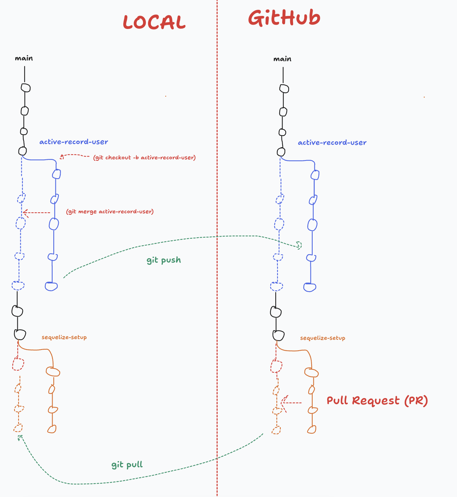

# J04 - Active Record, ORM & Sequelize

## Menu du jour 

```
- Correction challenge
  - Model `User` Active Record
  - Factorisation `CoreModel` (bonus)
  - Branches `git` (bonus)
 
- ORM `Sequelize`
  - Documentation
  - Installation
  - Mise en place des Models (setup)
  - Utilisation des Models (queries)
```

## Branche

Depuis un ETAT du dépôt, il est possible de créer une `branche` qui correspond à une VERSION du projet (partant de l'état courant).

On peut ensuite "switcher" entre les différentes `branches` du projet.

### Créer une branche 

Pour créer une branche et se placer dessus (au choix) : 
- `git checkout -b nom_de_la_branche`
- `git switch -c nom_de_la_branche`

### Changer de branche

Au choix :
- `git checkout nom_de_la_branche`
- `git switch nom_de_la_branche`

### Merger une branche dans une autre

- On se replace sur la branche cible
  - `git checkout main`
- On merge la "sous-branche" dans la branche courante 
  - `git merge nom_de_la_branche_a_merger`
- On push la branche principale
  - `git push`

### Proposer une Pull Request 

(PR = Pull Request = Merge Request) 

C'est une demande d'intégration de code d'une branche dans une autre, depuis l'interfacede Github : 
- en vu d'une relecture par les collègues (et d'une acceptation de celle-ci).

- Créer une branche en local
  - `git checkout -b nom_de_ma_branche`
- On travaille dessus, on fait des commits
  - `git add . && git commit -m "..."`
- On push sa branche sur GitHub
  - `git push` (et suivre les instructions si besoin)
- On créer sur l'interface GitHub une PR via l'onglet `Pull Request`
  - `main` <- `nom_de_ma_branche`
  - note : parfois la branche principale n'est pas `main` mais `master`
- On demande une review (optionnel) à un collègue
  - Ajouter un `reviewer` qui accepte ou non les modification
- On MERGE la PR depuis l'interface de GitHUb
  - CLiquer sur le bouton associé
- On met à jour sa branche `main` en local 
  - `git checkout main`
  - `git pull` les changement
  - note : pas besoin de merge en local car c'est fait sur GitHub et on vient de récupérer ce merge !

### Pourquoi le faire sur GitHub `VS` le faire en local ? 

- Quand on bosse à plusieurs, le système est bien pour faire relire son travail aux autres !
  - on voit les `DIFF` : les +++ (en vert) et les --- (en rouge) dans le fichier !

- Quand on bosse seul, le faire en local suffit largement.
  - toufois, on peut toujours faire des PR pour se relire avant de merger !
  - c'est même une recommendation :) 


### Schematiquement




## Différence `null` et `undefined`

- `null` = absence de valeur EXPLICITE 
  - ex : `return null` fait explicitement par un dev

- `undefined` = absence de valeur IMPLICITE
  - ex : accéder à une propriété qui n'existe
  - ex : accéder à un élément d'un tableau en se trompant d'index

## Object Relational Mapping (ORM)

ORM = Object Relational Mapping

- Object = `{...}`
- Relational = `table`
- Mapping = lien 

=> Bref, un outil qui fait le lien entre vos tables et vos objets JS !
(finalement, comme on a vu avec nos classes Active Record)

Sequelize => utilise le Design Pattern Active Record sous le capot ! 

Des ORM, il en existe pleins : 
- `Sequelize`
- `Prisma`
- `TypeORM`
- `Drizzle`

