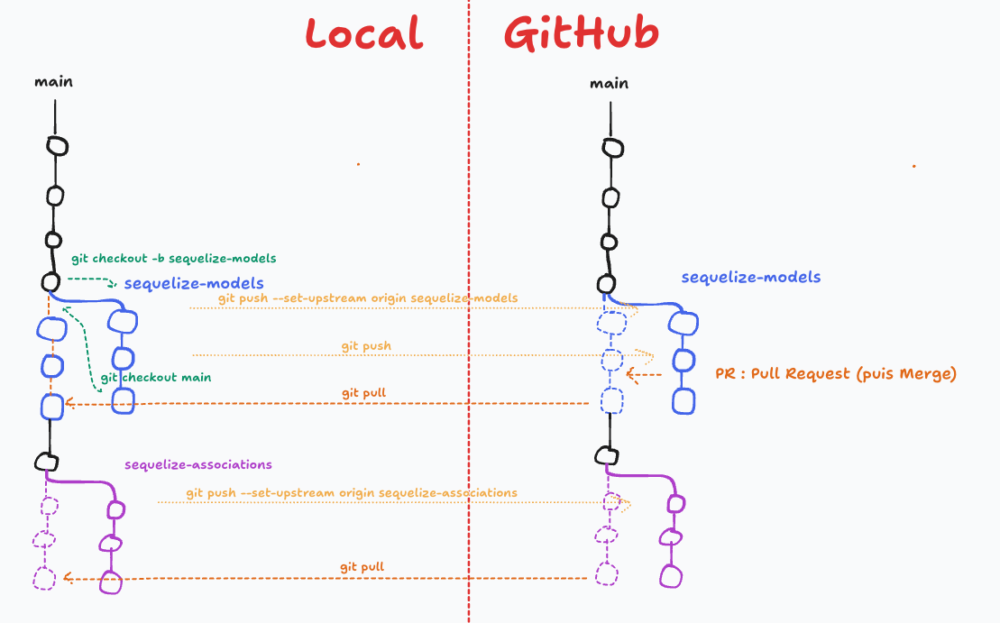

# J06 - Sequelize Model

## Menu du jour

```
- Correction challenge
  - Tous les modèles Sequelize
  - Révisions Git et branches

- Associations Sequelize
  - Mise en place
  - Quelques tests

- Révisions
  - Pages d'administration des levels
  - Ocode :
    - Requêtes complexes (jointures)
    - Lutins (Sequelize, mise en place des models et associations => fin de saison (vendredi ?))

- Oquiz is alive !
  - Énoncé **atelier PP**
  - Pas de challenge 🎉
```

## Méthode de classe vs méthode d'instance

```js
class SuperHero {
  height;
  superpower;

  constructor(...) { ... }

  // Méthode d'instance => des méthodes qu'on appelle sur UNE instance de SuperHero
  fly() { ... }
  eat() { ... }
  saveTheWorld() { ... }

  // Méthode de classe
  getGeneralInfo() { ... }
}


// Créer une instance
const peter = new SuperHero(190, "lancer des toiles d'araignée");
peter.fly(); 
peter.eat();
peter.saveTheWorld();

// Appeler une méthode de classe
SuperHero.getGeneralInfo(); // il y a actuellement 150 super héros présents.

```

## Sequelize

```js
// === CREATE ===
const bob = new User({ name: "Bob", email: "bob@bikini.io" });
await bob.save(); // Créer l'enregistrement en BDD

// === CREATE (*) ===
const patrick = await User.create({ name: "Patrick", "patrick@bikini.io" });

// === UPDATE ===
bob.email = "bob.leponge@bikini.io";
await bob.save(); // Modifie l'enregistrement en BDD

// === UPDATE (*) ===
await bob.set("name", "Bob l'Éponge"); // Modifie l'instance + le persiste en base du même coup 

// === DELETE ===
await bob.destroy(); // Supprime l'enregistrement de la BDD
```


```js
const { Sequelize } = require("sequelize");
//                    ^ module Sequelize

const sequelize = new Sequelize(...);
//    ^ instance de connexion = tunnel vers la BDD !


const sequelize = new Sequelize(process.env.PG_URL)
//                              ^ l'adresse de la BDD Postgres

const sequelize = new Sequelize(process.env.PG_URL)
//                ^ constructeur de la classe Sequelize

```

## DataTypes Sequelize

[Documentation pour la correspondance entre les types Sequelize et les types Postgres](https://sequelize.org/docs/v7/models/data-types/)

```js
const { DataTypes } = require("sequelize");

// Types "chaine de caractères"
DataTypes.TEXT          // TEXT (chaine de caractères sans limite)
DataTypes.STRING        // VARCHAR(255) (chaine de caractère de moins de 255 caractères)
DataTypes.STRING(100)   // VARCHAR(100)
DataTypes.CHAR          // CHAR(255) (chaine de caractère de 255 caractères tout pile !)
DataTypes.CHAR(7)       // CHAR(7) (chaine de caractères de 7 caractères tout pile !)

// Types "nombre"
DataTypes.INTEGER       // INTEGER (nombre entier)
DataTypes.FLOAT         // REAL (nombre à virgule)

```


## Convention en JS

- Nom de classe : `PascalCase`
- Nom d'instance === nom de variable : `camelCase`

```js
class Cat {} // PascalCase

const garfield = new Cat(...); // camelCase
```


## Associations

Rappel : deux entités peuvent être liées par une "association". Il existe plusieurs types d'associations : 
- `One-to-One`
- `One-To-Many`
- `Many-To-Many`

Documentation pour représenter ces associations dans Sequelize : [ici](https://sequelize.org/docs/v6/core-concepts/assocs/)

Deux étapes : 
- 1) Définir nos associations (par exemple dans `association.js`)
  - pourquoi dans un fichier à part ? pour éviter qu'un modèle A require un modèle B
- 2) Utiliser nos assocations (`include`)

## Particularité d'Oquiz

Dans le cadre du cours, on a écrit le fichier SQL à la main pour apprendre à utiliser SQL (ex : `CREATE TABLE` / `INSERT TO`).

Puis on a branché Sequelize et on essaie de **se greffer sur la base Postgres existante**.

Il est tout à fait possible de ne pas écrire le fichier SQL et laisser Sequelize gérer la création des tables (cf. S12) (ex : `sequelize.sync()`).

### Jointures SQL

L'idée : récupérer les données d'une table, et dans la **même requête** récupérer également les données d'une autre table associée.

Ex: 

```sql
SELECT * FROM "user"
JOIN "quiz"
ON "user"."id" = "quiz"."author_id"
WHERE "user"."id" = 1;
```

Conseils : 
- tester progressivement la construction. 
  - par exemple ici : 
    - `SELECT * FROM "user";`
    - `SELECT * FROM "user" JOIN "quiz" ON "quiz"."author_id" = "user"."id";` (-> observer vos tables !)
    - `SELECT * FROM "user" JOIN "quiz" ON "user"."id" = "quiz"."author_id" WHERE "user"."id" = 1;`
- jointures AVANT les éventuels filtrages et groupement.

Exercices possibles : `ocode 05.Database/03.jointures` et le suivant


## Observer les données récupérées de sequelize

- Si c'est un objet : 
  - `level.toJSON()`
  - `level.get()`

- Si c'est un tableau (d'objet) : 
  - `JSON.stringify(levels, null, 2)`
  ou bien
  - `levels.map(level => level.toJSON())`
  - `levels.map(level => level.get())`


## Injection SQL et ORM ? 

Bonne nouvelle, à **condition qu'il soit à jour**, notre ORM va éviter les potentielle injection SQL !

```js
const newTagName = req.body.tag;

await Tag.create({ name: newTagName });


// User 1 (😇) : `Cuisine`

// User 2 (😈) : `1; DROP TABLE "user"; --`
```


## Include `options`

```js
Model.findAll({ include: "property" });

// Equivalent => avantage, on peut inclure plusieurs props
Model.findAll({ include: ["property"] })

// Equivalent => avantage, on peut mettre un second include
Model.findAll({ include: { association: "property" } })

// Equivalent => avantage, on peut mettre plusieurs proprietes et plusieurs includes !
Model.findAll({ include: [{ association: "property" }] })
```


```js
await Question.findByPk(1, {
  include: [
    { association: "level" },
    { association: "quiz", include: ["tags", "author"] },
  ]
});
```


```js
await Question.findByPk(1, {
  include: [
    { association: "level" },
    {
      association: "quiz",
      include: [
        { association: "tags", limit: 2 },
        { association: "author", attributes: ["firstname", "lastname"] }
      ]
    },
  ]
});
```

Conseil : 
- Ecrire petit à petit :
  - récupérer la question 1
  - puis inclure le lvl
  - puis inclure le lvl et le quiz
  - puis include le lvl, et le quiz avec la seconde syntaxe
  - puis include le lvl, et le quiz avec la seconde syntaxe et le tags du quiz
  - puis include le lvl, et le quiz avec la seconde syntaxe et le tags+author du quiz
- Faites TRES attention à l'indentation, car on a des objects dans des tableaux dans des objets dans des tableaux !

## Branches et PR



