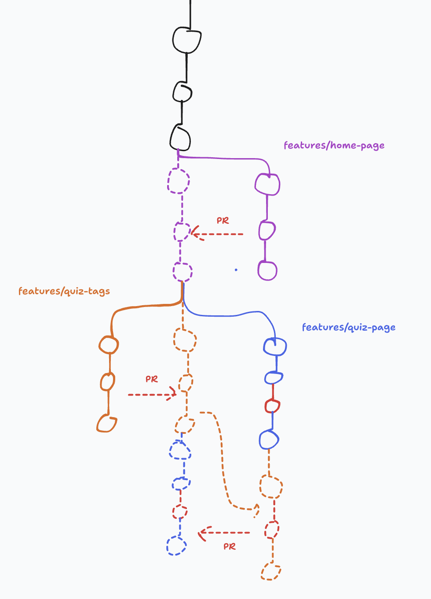
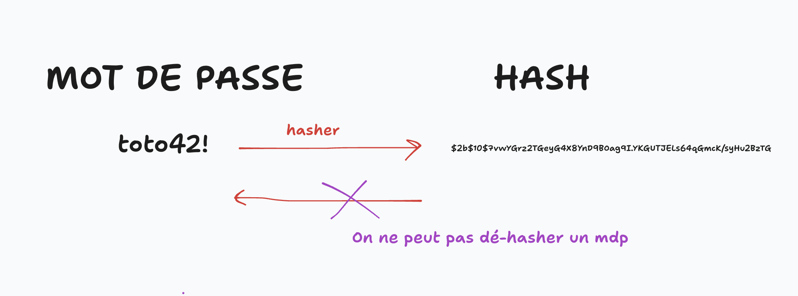

# J08 - Correction atelier et début Authentification

## Menu du jour 

```
- Correction challenge
  - Home page
  - Quiz page
  - Tags page

- Authentification
  - Signup page
    - Cas d'erreurs client
    - Hashage (`bcrypt` et/ou `scrypt`)
  - Login page
    - Cas d'erreurs client
    - Session
  - Deconnexion

- Droits & Roles
  - Roles : principes & implémentation
    - middlewares (`isAdmin`, `isAuthed`)
    - migrations (`add_role.sql`)

- Git / Github
  - Création de branche
  - Création de PR
  - Merge de branche
  - Résolution de conflits
```


## Rappel du lancement du projet

- Cloner
  - `git clone URL_SSH_DU_PROJET`
- Se déplacer dedans et l'ouvrir dans VsCode
  - `cd nom_du_depot && code .`
- Installer les dépendances 
  - `npm install`
- Gérer les variables d'environnements
  - `cp .env.example .env`
- Vérifier la BDD
  - `\du` && `\l` : vérifier si l'utilisateur et la base existe, sinon : 
    - `CREATE ROLE oquiz WITH LOGIN PASSWORD 'oquiz';`
    - `CREATE DATABASE oquiz WITH OWNER oquiz;`
- Vérifier les tables dans la BDD
  - `\c oquiz oquiz` && `\dt` && `SELECT * FROM level;`
  - Sinon : `exit` && `npm run db:reset`
- Lancer le projet
  - `npm run dev`


## Gestion de conflits

En cas de conflits, la PR est bloquée. Comment régler le problème ? On traite en local : 
- On retourne sur `main` pour le mettre à jour
  - `git checkout main && git pull`
- On retourne sur la branche que l'on souhaite merger et on merge main à l'intérieur
  - `git checkout ma_branche && git merge main`
- On règle les conflits
  - chercher les fichiers en conflits (indiqué par VSCode)
  - choisir les changements que l'on garde et que l'on jette
  - attention à ne pas laisser trainer des `<<<<` et `>>>>>` (ça fera planter le code)
  - on teste que le fonctionnement final est le bon !
- On commit et on push
  - `git add . && git commit -m "fix merge conflicts" && git push`
- On peut ensuite merger la branche dans le main 



## Vocabulaire

- Signup = Register = Se créer un compte = S'inscrire
  - proposition : `/register`
- Signin = Log in = Se connecter = Connexion
  - proposition : `/login`


## Protection des formulaires

### Côté client

On peut passer les `<input>` en `required`.

Mais ça ne suffit pas (NEVER TRUST CLIENT), n'importe qui peut modifier le DOM directement avec l'inspecteur par exemple. 

### Côté serveur

C'est le rôle du controleur : **valider les inputs** ! 


## OWASP = Open Web Application Security Project

[Lien wikipedia](https://fr.wikipedia.org/wiki/Open_Web_Application_Security_Project)

Assocation qui redige des recommandations pour la sécurité du web.

Notamment connue pour son [Top 10](https://owasp.org/www-project-top-ten/) des vulnérabilitéss les plus fréquentes.


## Stockage des mots de passe

Suggère également des [bonnes pratiques pour les mots de passe](https://cheatsheetseries.owasp.org/cheatsheets/Password_Storage_Cheat_Sheet.html).

La CNIL recommande notamment des MDP de plus de 12 caractères ([cf ici](https://www.cnil.fr/fr/mots-de-passe-une-nouvelle-recommandation-pour-maitriser-sa-securite))

Il est **impératif** de **hasher** nos mots de passes avant de les stocker en BDD. Pourquoi ? 
- s'il y a une fuite de la BDD (ex: qqun connait `oquiz` mdp `oquiz`) on dévoile les mdp de nos utilisateurs aux attaquants
- n'importe quel dev avec accès à la BDD serait en mesure de lire les mdps des utilisateurs

Rappels : 
- pensez à utiliser un **gestionnaire de mots de passe** (ex: `Bitwarden`) pour ne pas avoir le même mdp sur tous les sites ! 

Note vocabulaire : 
- éviter les mots suivants : `encrypter` / `decrypter` / `chiffrage`
- https://chiffrer.info/

Différence entre `hasher` et `chiffrer` : 
- **hachage** est une opération à sens unique 
  - `MDP` ----> `HASH`
- **chiffrement** est une opération à double sens
  - `MDP` <----> `MDP CHIFFRÉ` (notamment via un clé de déchiffrement)


Exemple d'utilisation pour le chiffrement : 
- Whatsapp : les messages Whatsapp sont chiffrés (si qqun les intercepte, il ne peut pas les lire car il n'a pas la clé de déchiffrement)
- HTTPS : les pages webs sont chiffrés par les serveurs et votre navigateur les déchiffre





## Utiliser bcrypt

```bash
npm install bcrypt
```

```js
// === A l'inscription ===

const bcrypt = require("bcrypt")

const plainTextPassword = "Pavlova42";
const saltRounds = 10; // Nombre de tour de salage (ie, la durée de l'algorithme)
const hashedPassword = await bcrypt.hash(plainTextPassword, saltRounds);

/* hashedPassword = 

$2b$10$7vwYGrz2TGeyG4X8YnD9BOag9I.YKGUTJELs64qGmcK/syHu2BzTG

^ $2b = nom de l'algo
   
   ^ $10 = le saltRounds

      ^ $7vwYGrz2TGeyG4X8YnD9BOag9I = le sel

                                  ^ YKGUTJELs64qGmcK/syHu2BzTG = le mot de passe hashé
*/
```

```js
// === A la connexion ===

const bcrypt = require("bcrypt");

const storedUser = { password: "$2b$10$7vwYGrz2TGeyG4X8YnD9BOag9I.YKGUTJELs64qGmcK/syHu2BzTG" };
const plainTextPassword = req.body.password; // "Pavlova42"

const isMatching = await bcrypt.compare(plainTextPassword, storedUser.password); // 'true' si ça match, 'false' sinon
```

Deux mots de passe identiques ne seront pas forcement hashé de la même manière : 
- Ex : `Pavlova42` --> `$2b$10$7vwYGrz2TGeyG4X8YnD9BOag9I.YKGUTJELs64qGmcK/syHu2BzTG` ou `$2b$10$bxAu/9kPBFPnWR6VA8S.WuZTDEkX0faDN/sIStBidbb4do53lllp.`

Pourquoi ça ? 
- Pour éviter les analyses statistiques sur notre BDD en cas de fuite de la BDD. 
- imaginons que 20% de nos utilisateurs utilise le mot de passe `password` ==> ils auraient tous le même mot de passe hashé et donc on peut "deviner" les mots de passe ou bruteforcer plus facilement. 

Comment éviter ça ? 
- Bcrypt génère un `sel` qu'il ajoute au mdp avant de le hasher


### SaltRounds ? 

C'est le temps que met l'algorithme à générer le sel. **Plus l'opération est longue, plus c'est sécurisé.**

A titre indicatif :


```js
rounds=8 : ~40 hashes/sec
rounds=9 : ~20 hashes/sec
rounds=10: ~10 hashes/sec    // généralement ce qui est choisi !
rounds=11: ~5  hashes/sec
rounds=12: 2-3 hashes/sec
rounds=13: ~1 sec/hash
rounds=14: ~1.5 sec/hash     // La ça commence à se sentir côté expérience utilisateur...
rounds=15: ~3 sec/hash
rounds=25: ~1 hour/hash
rounds=31: 2-3 days/hash     // Code d'accès nucléaires ? (nani?)
```

Généralement, on met cette information dans le `.env` histoire de ne pas faire fuiter nos configurations de stockage de mdp !

