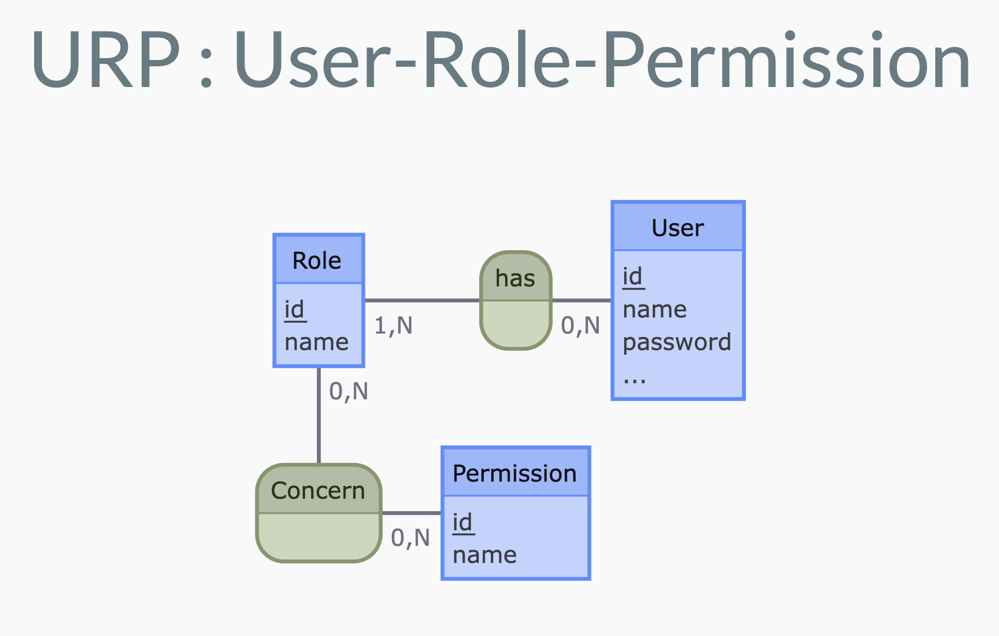

# J09 - Authentication & Git

## Menu du jour 

```
## Matin

- Authentification
  - Login
    - Session
    - Locals & middlewares
  - Deconnexion

- Droits & Roles
  - Roles : principes & implémentation
    - Migration de BDD
  - Droits
    - `isLoggedIn` middleware
    - `isAdmin` middleware

## Après-midi

- Git en pratique 
  - Branches
  - Pull Requests
  - Résolution de conflits
```


## Status code courant

- `2XX` : tout va bien
- `3XX` : redirection
- `4XX` : erreur client (le requêteur a fait une bétise)
- `5XX` : erreur serveur (le serveur et/ou la BDD a fait une bétise) 


- `200` : Ok
- `400` : Bad request (ex : mauvais body)
- `404` : Not Found (ex : accès à la page `/toto`)
- `401` : Unauthorized (ex : je ne suis pas connecté)
- `403` : Forbidden (ex: je suis connecté mais je ne suis pas admin)
- `500` : Server Error (ex : la BDD a planté, on reste flou pour le pas faire fuité d'information sur la structure de ma BDD)


## Rôle et droits

On veut stocker le fait que tel ou tel utilisateur est soit : `member` soit `admin`, plusieurs solution : 
- (simple) : ajout d'un champ `role` dans la table des `user`
- (complète) : Design Pattern URP
  - exemple de [dépôt de demonstration](https://github.com/enzoclock/express-user-role-permission/blob/main/app.js)





Question : je veux ajouter un champ `role` pour ma table `user` je vais où ? 
- ✅ Bonne pratique : maintenir propre notre MCD / MLD 
- Modifier le Model `User` et ajouter un attribut : `role`
- ❌ Modifier la structure de nos tables : 
  - ❌ dans `create_tables.sql` et refaire le `db:reset` ? 
    - ===> PBL : on va perdre nos utilisateurs !! (ex :`toto@oclock.io`) 
  - ✅ Ajouter un script :
    - ===> **SCRIPT DE MIGRATION** : script complémentaire qu'on lancera sur la BDD dont l'objetif est d'update le schema des tables 
    - on ne supprime pas, on modifie simplement en rajoutant une colonne dans la table USER


## Type de données

- `Double`
- `Real`
- `Float`
- `Decimal`

Sont des nombres à virgule. Ca dépend des languages. Dans certains languages, on peut avoir les 3 et la différence sera alors la **précision**, ie le nombre de chiffre après la virgule. 

