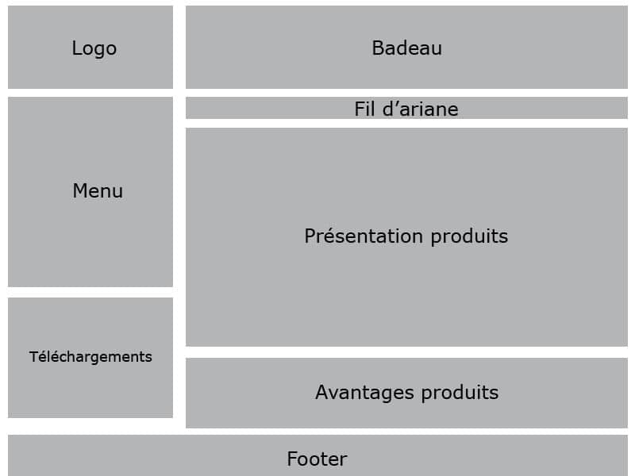
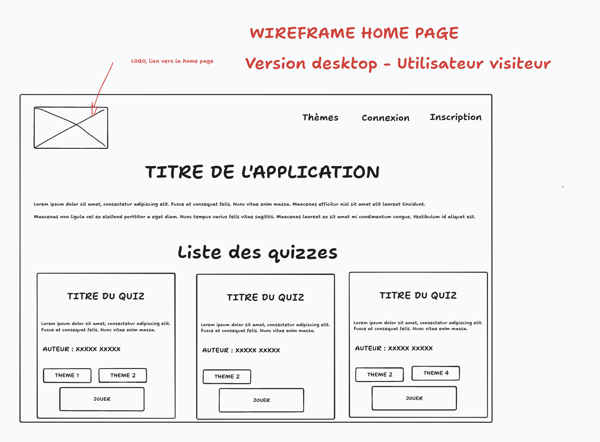
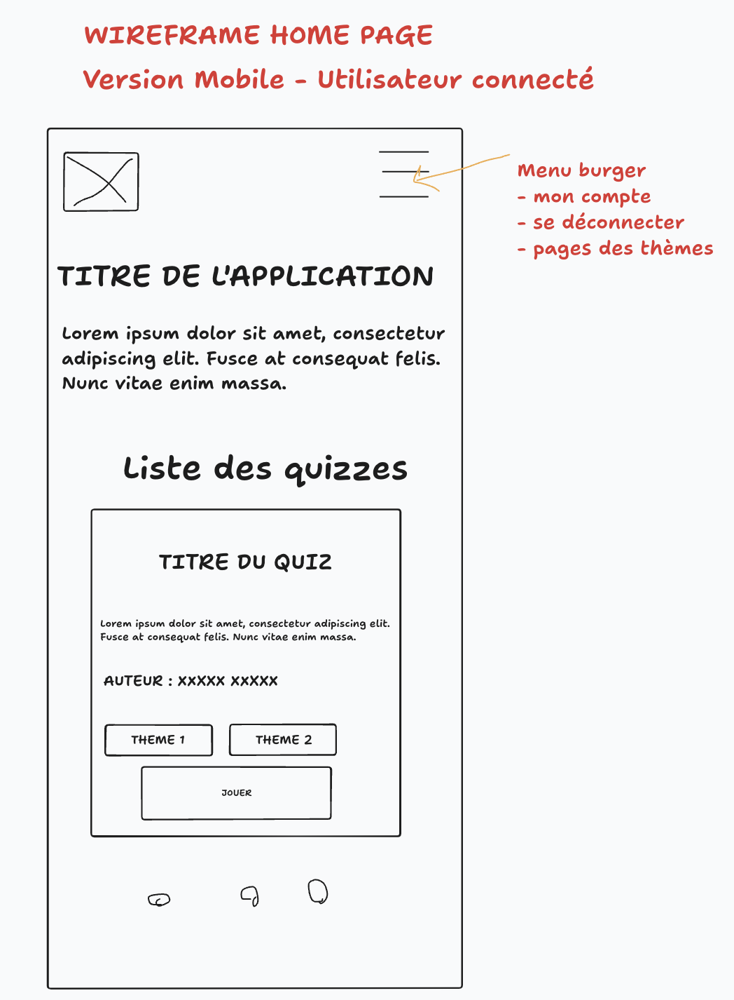

# Maquettage

Plusieurs étapes possibles pour le maquettage d'une application.

Généralement : **Zoning > Wireframes > Mockup**

Potentiellement aussi un **prototype** (soit via du code, soit via un outil dédié)

Attention, parfois les noms changent selon les sources... Il faut être souple !

## Zoning

Idée : découpage grossier des zones de l'application

Solutions :
- Papier / stylo
- Paint
- TLDraw (*)
- Google Draw
- Excalidraw

## Wireframe

Idée : un découpage NOIR ET BLANC, sans image dont l'objectif est de clarifier le besoin. Maquette "fonctionnelle" de l'application

Solutions :
- Papier / stylo
- Paint
- TLDraw (*)
- Google Draw
- Excalidraw
- Balsamiq
- Wireframe.cc
- Miro
- **Whimsical**

Exemple de wireframe de la home page décliné en plusieurs versions 

## Mockup

Le design final de la/les pages de l'app. Avec les couleurs, avec les images, etc.

Dans le cadre du TP, essayer au moins d'avoir une page sous forme de Mockup pour préciser que vous savez la différence. 

C'est plutôt le travail d'un **web designer**.

