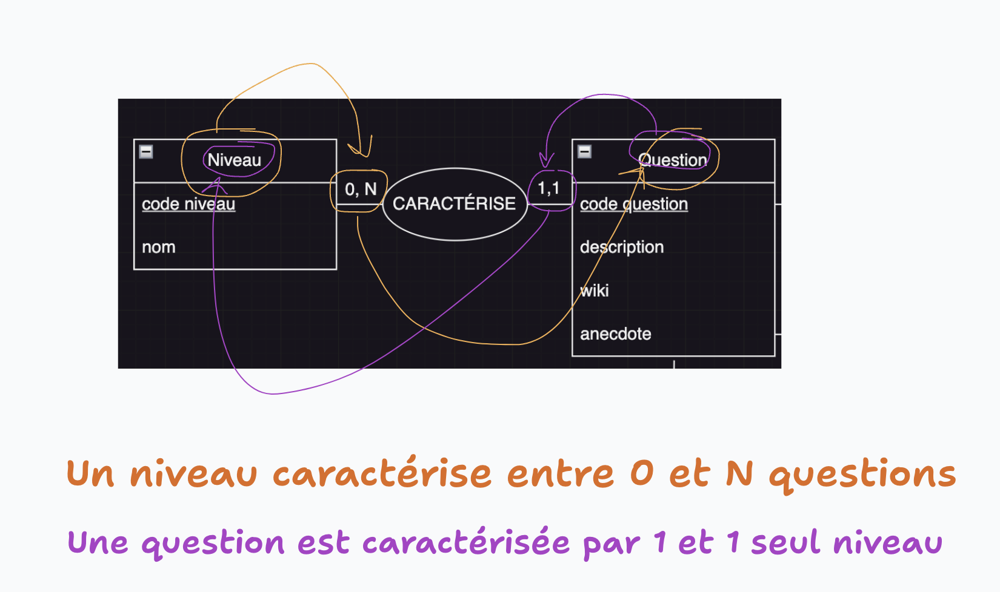

# Modèle Conceptuel de Données (MCD)

MCD, MLD, MPD s'inscrivent dans une méthodologie de modélisation qu'on appelle la méthode  **MERISE** (🇫🇷).

**Modélisation** = représentation de la réalité

**MERISE** = modélisation ce que l'on va stocker en BDD et comment on va le faire.

3 étapes : 
- `MCD` : 
  - objectif : **qu'est-ce qu'on veut stocker**
  - pour qui : pour mamie, pour les investisseurs...
  - très académique, très structuré, avec vocabulaire, généralement en français
- `MLD` :
  - objectif : **comment on va le stocker**
  - pour qui : technique, pour les devs
- `MPD` :
  - objectif : **stockons le**
  - pour qui : pour le SGBD

## Vocabulaire

On parle :
- d'**entité** (et non pas de table)
- d'**attributs** (et non pas de colonne)
- d'**associations** et de **cardinalités** (et non pas de clés étrangères ni de "relations" === "table" en anglais)
- de **discriminant** / **déterminant** (voire de "`code entité`") (et non pas d'ID ni de clé primaire)


## Etape 0 - Brouillon

Objectif : définir les **entités** et leurs **attributs**

(en particulier, chercher les attributs que l'on veut transformer en entité à part entière)

```
Utilisateurs (email, mdp, prenom, nom, role)

Quizzes (titre, description, #auteur, #themes, #questions)

Questions (description, wiki, anecdote, #niveau, #propositions)

Propositions (description, est correct)

Niveau (nom)

Thème (nom)
```

La question à se poser pour transformer un attribut en entité à part est : 
- est-ce que je veux pouvoir faire un CRUD sur l'attribut de manière indépendante du reste (voire une PARTIE de CRUD)

`CRUD = Create Read Update Delete`

La différence est en terme de FONCTIONNALITÉ attendue !


## Exemples 

- Quiz (title: "quiz de la tartiflette")
  - Question 1 (description: "comment couper les oignons ?")
    - Proposition 1 : (description : en dé)
    - Proposition 2 : (description : en lamelle)
    - ...
  - Question 2 (description : `de quelle régions... ?`)
    - Proposition 1 : (description Idf)
    - Prosition 2 : (description Savoie)

## Schématisation

Notes : 
- Carré = pour les entités
- Rond = pour les assocations


- Extension VSCode utile : `Draw.io Integration`
  - créer un fichier ensuite avec l'extension `.drawio`
  - => éditeur Draw.io intégré à VSCode


- Etape 1 : 
  - écrire les entités et attributs
  - souligner les **discriminants** = c'est l'attribut qui caractérise de manière unique une instance de l'entité
  - en cas d'impossibilité de choisir un attribut existant comme discriminant, n'hésitez pas à ajouter un attribut supplémentaire (`code entité`) dans votre entité. 


- Etape 2 : 
  - nommer les associations (verbe à l'indicatif ou l'infinitif, potentiellement à la voix passive)
  - ajouter les cardinalités de part et d'autre de l'association


## Choix de la cardinalité

- `0,N` et `1,N`, généralement on prévilégie `0,N` par simplicité

Ex : 

```
QUIZ <----> 0,N <----> THEME          

Un quiz a entre 0 et N thèmes ==> l'admin qui créé le quiz peut ne pas choisir de thème
```


```
QUIZ <----> 1,N <----> THEME          

Un quiz a entre 1 et N thèmes ==> l'admin qui créé le quiz sera forcé à choisir au minimum 1 thème lors de la création de celui-ci ==> ça nous rajoute du travail pour coder cette contraire.
```




## Outils

Il est possible de générer des MCD schématisé à partir de code source via des outils tel que : https://mocodo.net/

Mon conseil : commencez avec un `papier + crayon` puis `Draw.io`.

