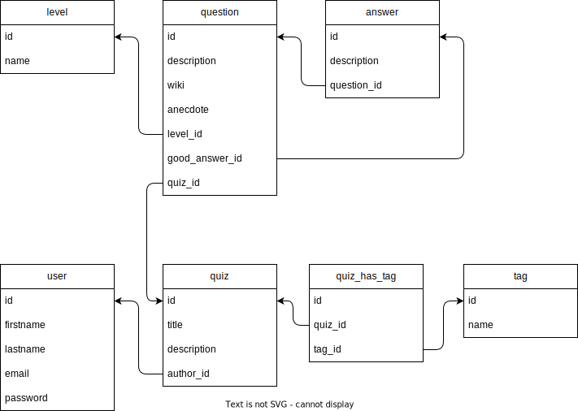

# Modèle logique de données

C'est une étape de **traduction** qui intervient après la création du MCD.

On prépare la mise en place dans la BDD (dans la BDD, on code en anglais).

Idée est de traduire :
- le français vers l'**anglais**
- les noms d'entité en nom de **table**
- les noms d'attributs en nom de **colonnes**
- les associations : 
  - **clés primaires** / **clés étrangères**
  - tables de liaisons


- Formalisme moins rigoureux : format textuel ou format graphique acceptés
- Deux écoles (mettre ou ne pas mettre les types) :
  - conseil : on ne MET PAS les types (raison : on a pas encore fixé le SGBD)
  - mais on triche un peu en les notant en français


## Traduire les associations

Il existe 3 types d'associations : 
- `One-to-One (1-1)`
- `One-to-Many (1-N)`
- `Many-to-Many (N-N)`

Pour déterminer quel type d'association on a, on prend le `(max-cardialité-gauche)-(max-cardialité-droite)`

```
UTILISATEUR <---- 0,N ----> CRÉE <--- 1,1 ----> QUIZ

                max(0,N)            max(1,1)

                N                   1

=> 1-N => One-To-Many
```

Traduction : 

- Pour les `One-to-One`
  - il suffit d'ajouter un champ d'un des deux côtés

- Pour les `One-to-Many`
  - il suffit d'ajouter une clé étrangère (côté du 1) qui pointe vers la clé primaire de l'autre table (côté du N)

- Pour les `Many-to-Many`
  - il suffit d'ajouter une table supplémentaire (table de liaison) qui contient les clés étrangères qui fait référence aux tables de part et d'autres

## Schéma textuel 

```

user (
  id                   -- identifiant nombre généré aléatoirement
  firstname            -- chaine de caractère
  lastname             -- chaine de caractère
  email                -- chaine de caractère de 255 caractères max
  password             -- chaine de caractère
)


quiz (
  id                   -- identifiant nombre généré aléatoirement
  title                -- chaine de caractère
  description          -- chaine de caractère
  author_id            -- clé étrangère -> #user.id    
)

tag (
  id                   -- identifiant nombre généré aléatoirement
  name                 -- chaine de caractère
)

quiz_has_tag (
  id                   -- identifiant nombre généré aléatoirement
  quiz_id              -- clé étrangère -> #quiz.id
  tag_id               -- clé étrangère -> #tag.id
)

question (
  id                   -- identifiant nombre généré aléatoirement
  description          -- chaine de caractère
  wiki                 -- chaine de caractère
  anecdote             -- chaine de caractère
  quiz_id              -- clé étrangère -> #quiz.id
  level_id             -- clé étrangère -> #level.id
  good_answer_id       -- clé étrangère -> #answer.id
)

level (
  id                   -- identifiant nombre généré aléatoirement
  name                 -- chaine de caractère
)

answer (
  id
  description
  question_id          -- clé étrangère -> #question.id
)
```


Autre façon d'écrire le MLD 

```
user (_id_, firstname, lastname, email, password)
quiz (_id_, description, wiki, anecdote, #author_id)

...

```

### Exemple d'enregistrements stockés

Dans la table `quiz`, on ajoute : 
- (id: 1, title: Quiz de la tartiflette)
- (id: 2, title: Quiz des JO)
- (id: 3, title: Quiz d'Oclock)

Dans la table `tag`, on ajoute : 
- (id: 1, name: Cuisine)
- (id: 2, name: Savoie)
- (id: 3, name: Sport)
- (id: 4, name: Tech)
- (id: 5, name: Aéronautique)
- (id: 6, name: Paris)


Dans la table `quiz_has_tag` on rajoute les enregistrement suivantes
- (quiz_id: 1, tag_id: 1)
- (quiz_id: 1, tag_id: 2)
- (quiz_id: 2, tag_id: 3)
- (quiz_id: 2, tag_id: 6)
- (quiz_id: 3, tag_id: 4)

## Version schématique

